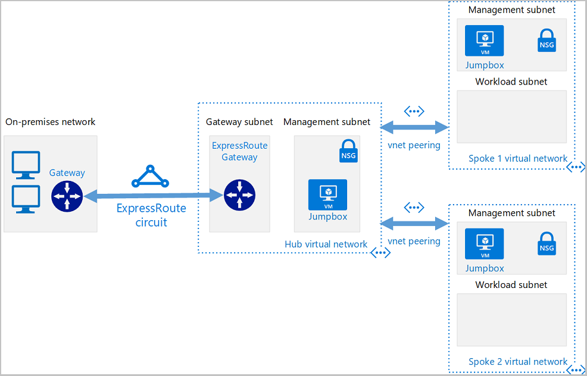

# Azure-Hub-Spoke-with-Terraform
## Introduction
This repo serves as a proof-of-concept deploying a hub-and-spoke network architecture in Azure using Terraform.

The following topology demonstrates the components in this hub and spoke architecture:

Understand Hub and Spoke Topology
The hub and spoke topology is a network design that isolates workloads while sharing common services like identity and security. The hub is a central VNet connected to the on-premises network, and the spokes are VNets that peer with the hub.

Hub-Spoke Use Cases:

The hub VNET could house certain services and resources that the isolated spoke networks each need to utilize. Workloads in different environments (e.g., development, testing, production) could utilize DNS, IDS, and/or AD DS.
For organizations that require central control over security.
Configure Your Environment
Before diving into Terraform, ensure your environment is set up with the necessary tools and access rights. This includes installing Terraform and configuring it to interact with Azure.

Components defined in the Terraform scripts we plan on deploying.

- **On-premises network**. A VNet in Azure will be used to simulate an on-premises local-area network running within an organization.
- **VPN device**. Either a hardware appliance or software solution, a VPN device/service serves to provide external connectivity to the on-premises network.
- **Hub VNet**. The central point of connectivity to your on-premises network and a place to host services consumed by the different workloads hosted in the spoke VNets.
- **Gateway subnet**. The VNet gateways are held in the same subnet.
- **Spoke VNets**. Spokes are used to isolate workloads in their own VNets, managed separately from other spokes.
- **VNet peering**. Peering connections are non-transitive, low latency connections between VNets. Once peered, the VNets exchange traffic by using the Azure backbone.

## Steps to Deploy

### Initialize Terraform

Run [`terraform init`](https://www.terraform.io/docs/commands/init.html) to initialize the Terraform deployment. This command downloads the Azure provider required to manage your Azure resources. 

```console
terraform init -upgrade
```
`-upgrade` parameter upgrades the necessary provider plugins to the newest version that complies with the configuration's version constraints.

### Create and Review the Terraform Execution Plan

Running [`terraform plan`](https://www.terraform.io/docs/commands/plan.html) creates an execution plan.

```console
terraform plan -out main.tfplan
```

- `terraform plan`: This command creates an execution plan but doesn't apply it. It determines the necessary actions to achieve the configuration specified in your Terraform files. This allows you to verify if the execution plan aligns with your expectations before making any changes to the actual resources.
- `-out` parameter: This optional parameter allows you to specify an output file for the plan. Using `-out` ensures that the plan you reviewed is exactly what gets applied when you run `terraform apply`.
This way, you can ensure that your infrastructure changes are predictable and controlled. It's a good practice to always review the plan before applying it to avoid any unexpected changes.

### Apply the Terraform Execution Plan 

```console
terraform apply main.tfplan
```

- `terraform apply`: This command applies the execution plan to your cloud infrastructure. It makes the actual changes to reach the desired state described in your Terraform configuration files.

- `terraform apply main.tfplan`: This example command assumes you previously ran `terraform plan -out main.tfplan`. It applies the execution plan stored in the `main.tfplan` file.

- If you specified a different filename for the `-out` parameter when you ran `terraform plan`, you should use that same filename in the call to `terraform apply`.

Choosing not to include the `-out` parameter when you running `terraform plan` will result in the automatic creation and application of an execution plan. That is, no initial review. 

### Verification and Testing
Time to verify the results of the Terraform deployment.

1. **Navigate to the resource group in the Azure portal**: Log in to your Azure account drill down the `onprem-vnet-rg` resource group page.

2. **Select the VM**: Within the `onprem-vnet-rg` resource group, select the VM named `onprem-vm`.

3. **Note the Public IP Address**: Take note of the Public IP Address value of the `onprem-vm`.

4. **SSH into the VM**: Return to the command line and run the following command to connect to the simulated on-premises environment via SSH:
    ```bash
    ssh azureuser@<onprem_vm_ip_address>
    ```
   Replace `<onprem_vm_ip_address>` with the Public IP Address you noted earlier. If you changed the username from `azureuser` in the `variables.tf` file, make sure to use that username in the SSH command. Use the password you specified when you ran `terraform plan`.

5. **Test connectivity to the hub VNet**: Once connected to the `onprem-vm` virtual machine, run the following command to test connectivity to the jumpbox VM in the hub VNet:
    ```bash
    ping 10.0.0.68
    ```

6. **Test connectivity to the spoke VMs**: Run the following commands to test connectivity to the jumpbox VMs in each spoke:
    ```bash
    ping 10.1.0.68
    ping 10.2.0.68
    ```

7. **Exit the SSH session**: To exit the SSH session on the `onprem-vm` virtual machine, enter `exit` and press `Enter`.

These steps help you verify that your Terraform deployment was successful and that the created resources are functioning as expected.

## Clean up resources
To clean up the the resources created:

1. **Run `terraform plan` with the `-destroy` flag**: 

    ```bash
    terraform plan -destroy -out main.destroy.tfplan
    ```
    This command creates an execution plan for destroying the resources specified in your Terraform configuration files. It doesn't execute the plan, but instead determines what actions are necessary to destroy the resources. This allows you to verify whether the execution plan matches your expectations before making any changes to actual resources.

2. **Run `terraform apply` to apply the execution plan**: This command applies the execution plan stored in the `main.destroy.tfplan` file, effectively destroying the resources.

    ```bash
    terraform apply main.destroy.tfplan
    ```